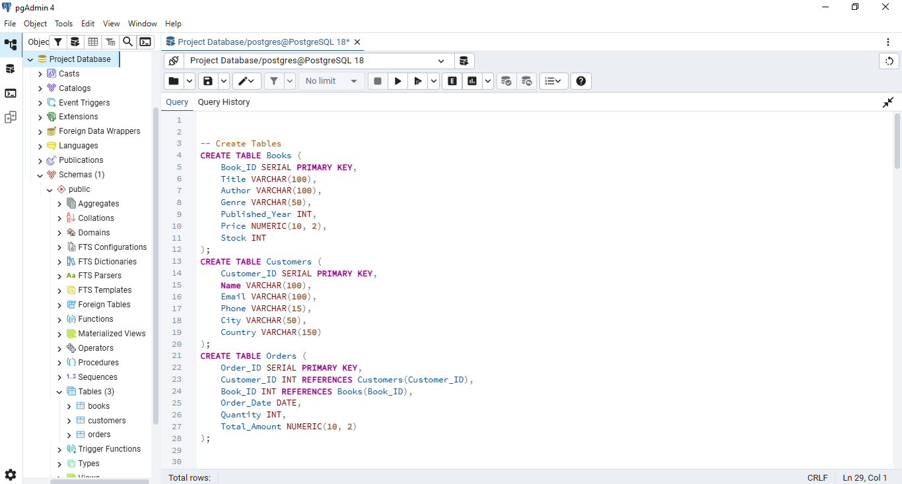

# 📚 Online Book Store Database Analysis using SQL

# 📚 Online Book Store Database Analysis using SQL

## 📖 Project Overview

This project demonstrates SQL skills by analyzing an Online Book Store database using PostgreSQL. The project includes three related tables (Books, Customers, and Orders) and solves business problems using SQL queries.

## 🛠️ Tools Used

* PostgreSQL
* SQL
* pgAdmin 4

## 📂 Dataset

* Books
* Customers
* Orders

## 🔑 SQL Concepts Used

* SELECT
* WHERE
* ORDER BY
* GROUP BY
* Aggregate Functions
* INNER JOIN
* LEFT JOIN
* HAVING
* COALESCE

## 📈 Business Insights

* Genre-wise Books Sold
* Customer Spending Analysis
* Remaining Stock Analysis
* Total Revenue Analysis
* Most Frequently Ordered Book

## 📷 Project Screenshots

### Database Schema

### Genre-wise Books Sold

### Customer Who Spent the Most

### Remaining Stock Analysis

## 📁 Project Files

* SQL Script (.sql)
* Books Dataset (.csv)
* Customers Dataset (.csv)
* Orders Dataset (.csv)
* Project Screenshots
